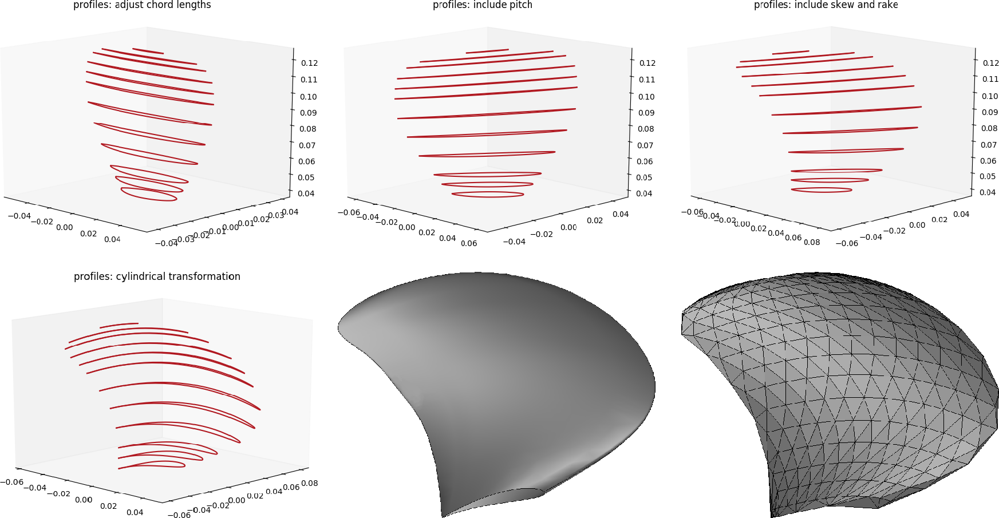

<p align="center">
  <a href="http://mathlab.github.io/BladeX/" target="_blank" >
    
  </a>
</p>
<p align="center">
	<a href="https://doi.org/10.21105/joss.01203" target="_blank">
        
    </a>
    <a href="LICENSE.rst" target="_blank">
        
    </a>
    <a href="https://travis-ci.org/mathLab/BladeX" target="_blank">
        
    </a>
    <a href="https://coveralls.io/github/mathLab/BladeX?branch=master" target="_blank">
        
    </a>
    <a href="https://www.codacy.com/app/mathLab/BladeX?utm_source=github.com&amp;utm_medium=referral&amp;utm_content=mathLab/BladeX&amp;utm_campaign=Badge_Grade" target="_blank">
        
    </a>
</p>

[BladeX](http://mathlab.github.io/BladeX/) (Python Blade Morphing) is a Python package for geometrical parametrization and bottom-up construction of propeller blades. It allows to generate and deform a blade based on the radial distribution of its parameters.

## Table of contents
* [Description](#description)
* [Dependencies and installation](#dependencies-and-installation)
	* [Installing from source](#installing-from-source)
* [Documentation](#documentation)
* [Testing](#testing)
* [Examples](#examples)
* [How to cite](#how-to-cite)
	* [Recent works with BladeX](#recent-works-with-bladex)
* [Authors and contributors](#authors-and-contributors)
* [Support](#support)
* [How to contribute](#how-to-contribute)
	* [Submitting a patch](#submitting-a-patch) 
* [License](#license)

## Description
**BladeX** is a Python package for geometrical parametrization and bottom-up construction of propeller blades. It allows to generate and deform a blade based on the radial distribution of its parameters such as `pitch`, `rake`, `skew`, and the sectional foils' parameters such as `chord` and `camber`. The package is ideally suited for parametric simulations on large number of blade deformations. It provides an automated procedure for the CAD generation, hence reducing the time and effort required for modelling. The main scope of BladeX is to deal with propeller blades, however it can be flexible to be applied on further applications with analogous geometrical structures such as aircraft wings, turbomachinery, or wind turbine blades.

See the [**Examples**](#examples) section below and the [**Tutorials**](tutorials/README.md) to have an idea of the potential of this package.

## Dependencies and installation
**BladeX** requires `numpy`, `scipy`, `matplotlib`, `sphinx` (for the documentation), and `nose` (for the local test). They can be easily installed using `pip`. 
**BladeX** is compatible with Python 2.7 and Python 3.6. Moreover, some of the modules require `OCC` to be installed for the `.iges` or `.stl` CAD generation. Please see the table below for instructions on how to satisfy the `OCC` requirements. You can also refer to `pythonocc.org` or `github.com/tpaviot/pythonocc-core` for further instructions.

| Package | Version     | How to install (precompiled binaries via conda)                                                                      |
|---------|-------------|----------------------------------------------------------------------------------------------------------------------|
| OCC     | ==0.18.1    | Python2.7 `conda install -c conda-forge -c dlr-sc -c pythonocc -c oce pythonocc-core==0.18.1 smesh=6.7.5 python=2.7` |
| OCC     | ==0.18.1    | Python3.6 `conda install -c conda-forge -c dlr-sc -c pythonocc -c oce pythonocc-core==0.18.1 smesh=6.7.5 python=3.6` |


### Installing from source
The official distribution is on GitHub, and you can clone the repository using
```bash
> git clone https://github.com/mathLab/BladeX
```

To install the latest version of the package just type:
```bash
> pip install git+https://github.com/mathLab/BladeX.git
```

Otherwise to install your own local branch you can use the `setup.py` file
```bash
> python setup.py install
```

To uninstall the package just use pip again:

```bash
> pip uninstall bladex
```

## Documentation
**BladeX** uses [Sphinx](http://www.sphinx-doc.org/en/stable/) for code documentation. You can view the documentation online [here](http://mathlab.github.io/BladeX/). To build the html version of the docs locally simply:

```bash
> cd docs
> make html
```

The generated html can be found in `docs/build/html`. Open up the `index.html` you find there to browse.


## Testing

We are using Travis CI for continuous intergration testing. You can check out the current status [here](https://travis-ci.org/mathLab/BladeX).

To run tests locally:

```bash
> python test.py
```

## Examples
You can find useful tutorials on how to use the package in the [tutorials](tutorials/README.md) folder.
Here we show a bottom-up parametrized construction of the [Potsdam Propeller Test Case (PPTC)](https://www.sva-potsdam.de/pptc-smp11-workshop) provided the sectional profiles as well as the radial distribution of the `pitch`, `rake`, `skew`. The blade is generated and exported to .iges and .stl formats.

<p align="center">

</p>
<p align="center">
<em>PPTC blade generation according to the radial distribution of the pitch, rake, skew. The generated blade is then exported to .iges and .stl formats.</em>
</p>

Two possible deformed geometry configurations, to show the capabilities of the package, are presented here:

<p align="center">

</p>
<p align="center">
<em>Undeformed reference blade on the left, and a couple of deformed configurations obtained by moving some control points defining the skew and chord length radial distributions.</em>
</p>

## How to cite
If you use this package in your publications please cite the package as follows:

Gadalla et al., (2019). BladeX: Python Blade Morphing. Journal of Open Source Software, 4(34), 1203, https://doi.org/10.21105/joss.01203

Or if you use LaTeX:
```tex
@article{gadalla19bladex,
  Author = {Gadalla, Mahmoud and Tezzele, Marco and Mola, Andrea and Rozza, Gianluigi},
  Title = {{BladeX: Python Blade Morphing}},
  Journal = {The Journal of Open Source Software},
  Volume = {4},
  Number = {34},
  Pages = {1203},
  Year = {2019},
  Doi = {https://doi.org/10.21105/joss.01203}
}
```

### Recent works with BladeX
Here there is a list of the scientific works involving **BladeX** you can consult and/or cite. If you want to add one, please open a PR.

* Mola, Tezzele, Gadalla, Valdenazzi, Grassi, Padovan, Rozza. *Efficient reduction in shape parameter space dimension for ship propeller blade design*. In Proceedings of MARINE 2019: VIII International Conference on Computational Methods in Marine Engineering, pages 201–212, 2019. [[DOI](https://congress.cimne.com/marine2019/frontal/Doc/EbookMarine2019.pdf)] [[arXiv](https://arxiv.org/abs/1905.09815)] [[bibitem](readme/mola2019marine.bib)].

* Tezzele, Demo, Mola, Rozza. *An integrated data-driven computational pipeline with model order reduction for industrial and applied mathematics*. Submitted, 2018. [[arXiv](https://arxiv.org/abs/1810.12364)] [[bibitem](readme/tezzele2018ecmi.bib)].


## Authors and contributors
**BladeX** is currently developed and mantained at [SISSA mathLab](http://mathlab.sissa.it/) by
* [Mahmoud Gadalla](mailto:gadalla.mah@gmail.com)
* [Marco Tezzele](mailto:marcotez@gmail.com)

under the supervision of [Dr. Andrea Mola](mailto:andrea.mola@sissa.it) and [Prof. Gianluigi Rozza](mailto:gianluigi.rozza@sissa.it) in the framework of the project [PRELICA: Advanced Methodologies for Hydro-acoustic Design of Naval Propulsion](https://mathlab.sissa.it/project/prelica-metodologie-avanzate-la-progettazione-idro-acustica-dell%E2%80%99elica-navale-por-fesr-2017).

## Support

Contact us by email for further information or questions about **BladeX**. Feel free to suggest pull requests or to open GitHub issues. Contributions improving either the code or the documentation are welcome!


## How to contribute
We'd love to accept your patches and contributions to this project. There are just a few small guidelines you need to follow.

### Submitting a patch

  1. It's generally best to start by opening a new issue describing the bug or
     feature you're intending to fix.  Even if you think it's relatively minor,
     it's helpful to know what people are working on.  Mention in the initial
     issue that you are planning to work on that bug or feature so that it can
     be assigned to you.

  2. Follow the normal process of [forking][] the project, and setup a new
     branch to work in.  It's important that each group of changes be done in
     separate branches in order to ensure that a pull request only includes the
     commits related to that bug or feature.

  3. To ensure properly formatted code, please make sure to use 4
     spaces to indent the code. The easy way is to run on your bash the provided
     script: ./code_formatter.sh. You should also run [pylint][] over your code.
     It's not strictly necessary that your code be completely "lint-free",
     but this will help you find common style issues.

  4. Any significant changes should almost always be accompanied by tests.  The
     project already has good test coverage, so look at some of the existing
     tests if you're unsure how to go about it. We're using [coveralls][] that
     is an invaluable tools for seeing which parts of your code aren't being
     exercised by your tests.

  5. Do your best to have [well-formed commit messages][] for each change.
     This provides consistency throughout the project, and ensures that commit
     messages are able to be formatted properly by various git tools.

  6. Finally, push the commits to your fork and submit a [pull request][]. Please,
     remember to rebase properly in order to maintain a clean, linear git history.

[forking]: https://help.github.com/articles/fork-a-repo
[pylint]: https://www.pylint.org/
[coveralls]: https://coveralls.io
[well-formed commit messages]: http://tbaggery.com/2008/04/19/a-note-about-git-commit-messages.html
[pull request]: https://help.github.com/articles/creating-a-pull-request


## License

See the [LICENSE](LICENSE.rst) file for license rights and limitations (MIT).
