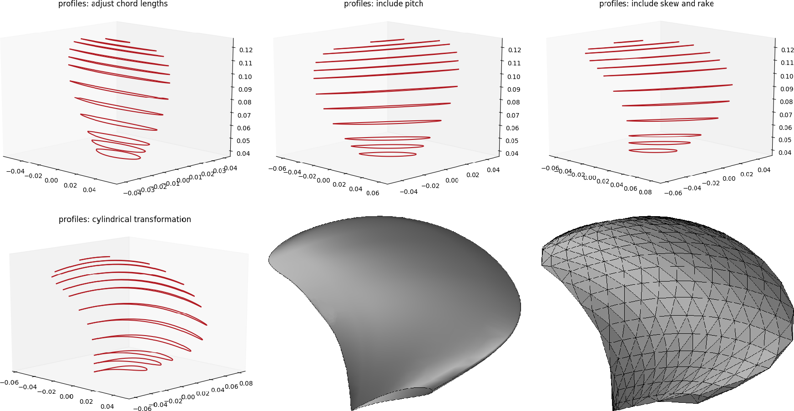

# Summary

Marine propeller blade shape is constantly studied by engineers to obtain designs which allow for enhanced hydrodynamic performance while reducing vibrations and noise emissions. In such framework, shape parametrization and morphing algorithms are crucial elements of the numerical simulation and prototipation environment required for the evaluation of new blade geometries. By a practical standpoint, the propeller blade is uniquely described by the following parameters: the shape of a certain number of sectional profile shapes, complemented by the pitch, skew, rake, and chord length values corresponding to each section along the radial direction. Taking such parameters into account we are able to construct a blade and, parametrizing the aforementioned quantities by spline reconstruction, we are able to morph every single section. This results in a morphing tool that expand in a non-intrusive way the naval engineering consolidated design techniques. In particular
we followed [@carlton2012marine] for marine propeller blades construction, conventions, and terminology. 

In the BladeX Python package [@bladex] we implemented the bottom-up construction of blades given the radial distribution of pitch, skew, rake, chord, and camber of the sectional profiles. We also provide several tutorials showing how to construct or import sectional profiles in 2D and then how to generate the desired 3D representation of the blade. It is also possible to export the final design in CAD files such as iges and stl. Even if the focus is on marine propeller blades, the software is general enough to produce, for instance, aircraft wings or wind turbine blades. It is particularly suited for simulation driven design shape optimization.

The package has already been used within the research project PRELICA, “Advanced methodologies for hydro-acoustic design of naval propulsion”, with both industrial and academic partners, and some results can be found in [@tezzele2018ecmi]. This highlights that the target user of this package is either a numerical analyst working in academia or a skilled engineer working in the naval construction field.

As an example, we show below a bottom-up construction of a benchmark blade called PPTC, and the resulted iges and stl file formats.

Here we have the undeformed reference blade and a couple of deformed configurations obtained by moving some control points defining the skew and chord length radial distributions.

# Acknowledgements
This work was partially supported by the project PRELICA, “Advanced methodologies for hydro-acoustic design of naval propulsion”, supported by Regione FVG, POR-FESR 2014-2020, Piano Operativo Regionale Fondo Europeo per lo Sviluppo Regionale, and by European Union Funding for Research and Innovation — Horizon 2020 Program — in the framework of European Research Council Executive Agency: H2020 ERC CoG 2015 AROMA-CFD project 681447 “Advanced Reduced Order Methods with Applications in Computational Fluid Dynamics” P.I. Gianluigi Rozza.

# References
